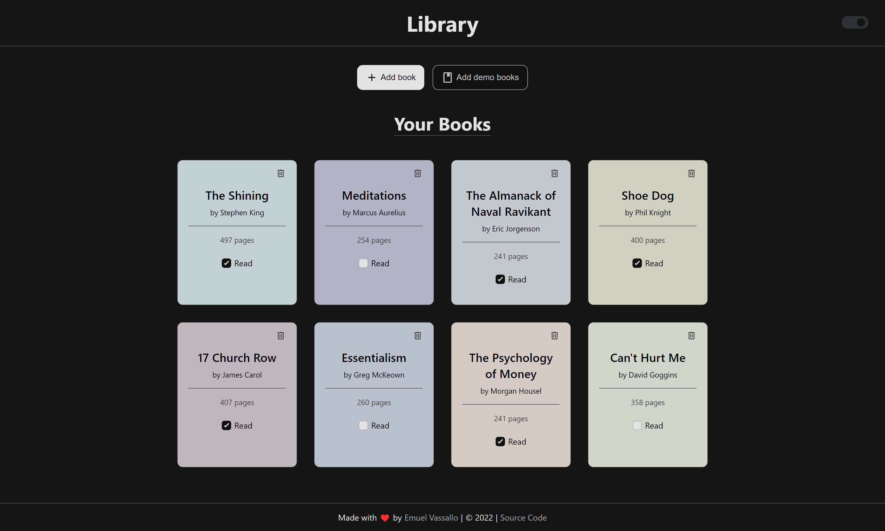
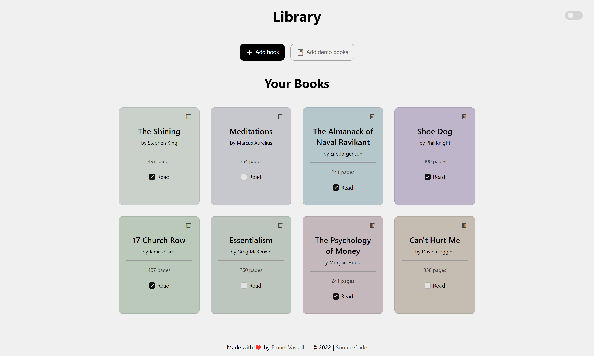

# Library

A simple library app focused on minimalism and aesthetics with pastel and muted colors. Created as part of The Odin Project's [curriculum](https://www.theodinproject.com/lessons/node-path-javascript-library).

### [Live Demo](https://emuel-vassallo.github.io/library/)

## Showcase

### Dark Theme

### Light Theme

## Built With

- HTML
- CSS
- JavaScript

## Features

- Minimalistic UI
- Pastel and muted colors
- Dark/Light theme toggle switch
- Empty library message
- Button to add four books for demo purposes
- Smooth animations and transitions
- New book modal form

## What I Learned

- Appending a container with elements using JavaScript
- Getting a random pastel color and assign it to each book instance
- Removing an item from a grid when clicking a button
- Using form data to create an element that includes it (book)
- Using object constructors and creating instances with it

